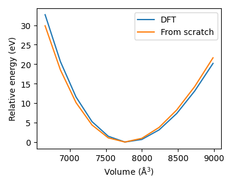

# SevenNet_dFS

**SevenNet_dFS** is an extended version of [**SevenNet**](https://github.com/MDIL-SNU/SevenNet), a machine-learning-based force field model tailored for molecular dynamics (MD) simulations.

## Key Differences

```diff
+ Direct force and stress prediction output
+ Integrated derivative values during training for higher accuracy
+ Up to 5x faster inference speed
+ Up to 250x faster MD simulation speed
- Non-conservative MD simulation
- Slower training speed
```

## Performance

| Metric                      | Improvement         |
|-----------------------------|---------------------|
| Training Speed         | ✅ 1.59x Slower      |
| Inference Speed         | ✅ 4.91x Faster      |
| MD Simulation Speed         | ✅ 255.28x Faster      |
| Prediction Accuracy         | ✅ Enhanced         |
| Inference Computational Cost| ✅ Significantly Reduced |

We prepared our tutorial example of Li-argyrodite (Li6PS5Cl) data, which consists of total 2000 data with each data has 416 nodes (Li192P32S160Cl32) and 8,332 edges (in case of 4.5 Å cutoff).

We've achieved strong performance of validation RMSE: 1 meV/atom (energy), 0.074 eV/Ang. (force), and 0.641 kbar (stress).




## Quick Start

```bash
# Clone Repository
git clone https://github.com/hyukjunlim/SevenNet-dFS.git
cd SevenNet_dFS

# Install dependencies
pip install sevenn

# Run inference example
cd sevennet_tutorial
python tuto.py
```

## Citation<a name="citation"></a>

If you use this code, please cite our paper:
```bibtex
@article{park_scalable_2024,
	title = {Scalable Parallel Algorithm for Graph Neural Network Interatomic Potentials in Molecular Dynamics Simulations},
	volume = {20},
	doi = {10.1021/acs.jctc.4c00190},
	number = {11},
	journal = {J. Chem. Theory Comput.},
	author = {Park, Yutack and Kim, Jaesun and Hwang, Seungwoo and Han, Seungwu},
	year = {2024},
	pages = {4857--4868},
}
```