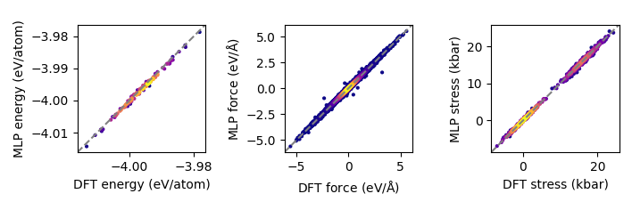

# SevenNet_dFS

**SevenNet_dFS** is an extended version of [**SevenNet**](https://github.com/MDIL-SNU/SevenNet), a machine learning force field model tailored for molecular dynamics (MD) simulations.

## Key Differences

```diff
+ Direct force and stress prediction output
+ Integrated derivative values during training for higher accuracy
+ Up to 5x faster inference speed
+ Up to 250x faster MD simulation speed
- Non-conservative MD simulation
- Slower training speed
```

## Performance

| Metric                      | Improvement                  |
|-----------------------------|------------------------------|
| Training Speed                 | ⚠️ 1.59x slower           |
| Inference Speed                | ✅ 4.91x faster           |
| MD Simulation Speed            | ✅ 255.28x faster         |
| Prediction Accuracy            | ✅ Excellent              |
| MD/Inference Computational Cost| ✅ Significantly reduced  |

Our example dataset for Li-argyrodite (Li<sub>6</sub>PS<sub>5</sub>Cl) consists of 2,000 configurations, each containing 416 nodes (Li<sub>192</sub>P<sub>32</sub>S<sub>160</sub>Cl<sub>32</sub>) and 8,332 edges (with a cutoff radius of 4.5 Å).

The model achieved excellent validation performance:

- **Energy RMSE:** 1 meV/atom
- **Force RMSE:** 0.074 eV/\AA
- **Stress RMSE:** 0.641 kbar

<div style="display: flex; align-items: center; justify-content: start; gap: 10px;">
  
  
</div>

## Quick Start

```bash
# Clone Repository
git clone https://github.com/hyukjunlim/SevenNet-dFS.git
cd SevenNet_dFS

# Install dependencies
pip install sevenn

# Run tutorial example
cd sevennet_tutorial
python tuto.py
```

## Citation<a name="citation"></a>

If you use this code, please cite the SevenNet paper:
```bibtex
@article{park_scalable_2024,
	title = {Scalable Parallel Algorithm for Graph Neural Network Interatomic Potentials in Molecular Dynamics Simulations},
	volume = {20},
	doi = {10.1021/acs.jctc.4c00190},
	number = {11},
	journal = {J. Chem. Theory Comput.},
	author = {Park, Yutack and Kim, Jaesun and Hwang, Seungwoo and Han, Seungwu},
	year = {2024},
	pages = {4857--4868},
}
```